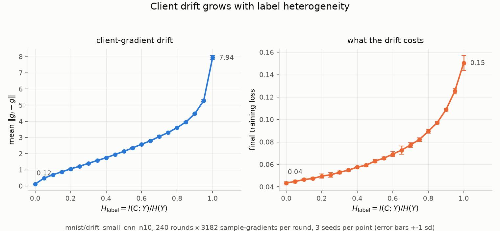

# Experiments — MNIST

Same questions as [experiments_CIFAR100.md](experiments_CIFAR100.md), on the cheap
dataset. What changes across the port, once, for every experiment here:

- Label skew is drawn over the **10 digits** — MNIST has no coarse superclasses, so the
  digits are both the training targets and the skew axis.
- `--partition target_h` needs `--clients` to divide 10, so the client count is **10**,
  not the 20 used on CIFAR-100. 10 is also the only count whose ceiling
  `1 - log(10/n)/log(10)` reaches 1.0, i.e. that spans the full `H_label` range.
- One epoch is 60000 samples, not 50000 — round budgets are recomputed, never copied.
- `--model linear` (multinomial logistic regression) is available as a **convex** arm,
  which CIFAR-100 does not have. Local SGD's rates are stated for convex objectives, so
  this is where a measured penalty can be checked against a prediction.
- Results land under `runs/mnist/`, keeping them out of the CIFAR-100 plots.
- **Caveat.** `by_target_h` promises equal shard sizes at every H, and that holds exactly
  on CIFAR-100 (500 images per class) but only approximately on MNIST, whose digit counts
  run 5421–6742. At 10 clients each client owns one digit, so shard size varies by about
  ±10% and is correlated with client identity. Small next to the drift effect, but it is a
  confound CIFAR-100 does not have.

## 1. Client drift vs. label heterogeneity  (MNIST port)

**Claim.** Client drift grows with data heterogeneity — same claim as CIFAR-100
experiment 1, retested where the objective can also be made convex.

Definitions of the two axes (`H_label = I(C;Y)/H(Y)`, and
`drift_t = (1/n) sum_i ||g_i - g||` from exact full-shard gradients at the broadcast
point) are unchanged; see experiment 1 in
[experiments_CIFAR100.md](experiments_CIFAR100.md) for the derivation and for why
full-shard rather than mini-batch gradients are used.

**Configuration.** `small_cnn` (1x28x28 input, 10 logits), full MNIST, **10 clients**,
**240 rounds**, K=5 local steps, lr 0.05, batch 64, drift measured every 10 rounds (24
samples per run), loss every 20. `H_label` swept over {0.00, 0.05, ..., 1.00} at seeds
0, 1, 2 — 21 jobs, one per H, each running all three seeds.

240 rounds is the equal-epoch translation of CIFAR-100's 100: both spend 12.8 epochs
(`rounds x clients x K x batch / dataset size`), so the loss panel is comparable across
the two datasets rather than comparable in rounds.

**Running.**

    condor_submit jobs/drift_mnist_sweep.sub     # cluster, 21 parallel jobs
    MODEL=linear jobs/drift_mnist_one.sh 0.5     # single cell, convex arm

The convex sweep is the same 21 jobs with `environment = "MODEL=linear"` in the `.sub`;
it is a separate submission rather than a second model in the same job, to stay inside
the 40-job budget.

**Results.** One CSV per run in `runs/mnist/drift_small_cnn_n10/`, named
`targeth<H>_s<seed>.csv`, columns
`round, grad_computations, train_loss, drift, grad_norm, h_label`. Drift and grad_norm
are empty on rows logged but not measured. Drift-measurement gradients are not counted in
`grad_computations`.

**Plot.** `python plots/drift_vs_heterogeneity.py runs/mnist/drift_small_cnn_n10`
-> `plots/drift_vs_heterogeneity_mnist_drift_small_cnn_n10.png`. The figure is named after the run
dir; pass the dir explicitly, or it plots the CIFAR-100 runs. Two panels: absolute drift,
and the final training loss the drift costs.

### Results

Run 2026-09-02 on SaarlandHPC (condor, docker universe, GPU), cluster 185301, 21 jobs x 3
seeds, all 63 runs completed with no failures. Wall time ~75 min.

    H_label   drift    sd     drift/|g|   final loss
    ------------------------------------------------
       0.00   0.120  0.007       0.62      0.0435
       0.05   0.483  0.011       1.87      0.0448
       0.10   0.697  0.017       2.82      0.0465
       0.15   0.876  0.016       3.85      0.0474
       0.20   1.056  0.013       4.21      0.0496
       0.25   1.220  0.021       5.12      0.0508
       0.30   1.401  0.020       5.35      0.0529
       0.35   1.576  0.025       6.28      0.0549
       0.40   1.748  0.040       6.78      0.0576
       0.45   1.946  0.028       7.58      0.0593
       0.50   2.141  0.027       7.99      0.0630
       0.55   2.359  0.012       8.78      0.0655
       0.60   2.584  0.005       8.63      0.0692
       0.65   2.793  0.034       9.09      0.0727
       0.70   3.064  0.057       8.90      0.0774
       0.75   3.305  0.038       9.79      0.0822
       0.80   3.612  0.007       9.65      0.0895
       0.85   3.957  0.023       9.92      0.0971
       0.90   4.473  0.028       9.49      0.1087
       0.95   5.281  0.046      10.69      0.1254
       1.00   7.941  0.141       5.30      0.1505

**The CIFAR-100 result replicates.** Drift rises monotonically across the whole range with
no turnover, 0.12 to 7.94 — a **66x** increase, against 15x on CIFAR-100. Seed standard
deviations are 0.005-0.141 on values of 0.1-8, so the trend again dwarfs the noise. Final
training loss rises monotonically too, 0.044 to 0.151, a 3.5x cost for the same gradient
budget.

Two differences worth recording against the CIFAR-100 run:

- **The IID floor is much lower** (0.12 vs 0.46 absolute, 0.62 vs 0.98 relative). With
  10 clients rather than 20 each shard is larger, and MNIST's gradients are less noisy, so
  a genuinely IID split leaves less residual disagreement between clients.
- **The curve is convex here, concave on CIFAR-100.** CIFAR-100 rises steeply out of IID
  and then flattens (0.46 -> 3.5 over the first quarter of the range, 3.5 -> 6.95 over the
  remaining three quarters). MNIST is close to linear until H=0.9 and then jumps: the last
  step, 0.95 -> 1.00, adds 2.66 on its own, half again as much as the whole first quarter.
  At H=1.0 each of the 10 clients holds exactly one digit and its local objective is a
  degenerate one-class problem; with 20 clients over 20 superclasses the same corner is
  much less extreme, since one CIFAR-100 superclass still spans 5 fine labels. The
  pathological corner is simply more pathological on MNIST.

**The relative panel turns over at H=1.0** (10.69 -> 5.30), the only non-monotonicity
anywhere in either dataset. It is the denominator moving, not the drift, and the cause is a
genuine discontinuity in the partition rather than anything about the plot.

`by_target_h` spreads a fraction (1-t) of every digit uniformly over all clients. Just below
the top of the range that remainder is small but NONZERO -- at H=0.95 client 0 holds 5907
samples of digit 0 plus about 10 of each other digit. At H=1.0, t is exactly 1 and the
remainder is exactly zero: client 0 holds 6000 of digit 0 and nothing else. Its local
objective becomes single-class cross-entropy, which has no interior minimum -- it is
minimized by sending one logit to +infinity -- so every local step pushes in a direction
that never saturates.

The global gradient norm shows it directly (seed 0, first 10 measured rounds):

    H=0.90   0.68 1.35 1.63 1.36 1.08 0.84 0.65 0.57 0.46 0.37    rises, then decays
    H=0.95   0.68 1.35 1.56 1.43 1.04 0.83 0.57 0.67 0.60 0.47    rises, then decays
    H=1.00   0.68 1.54 3.47 5.35 4.34 1.90 2.17 1.34 3.04 1.13    never settles

Mean ||g|| over the run is 0.566 at H=0.95 and 1.964 at H=1.0, a 3.5x jump against only
1.5x in the numerator; 1.5/3.5 is the factor of ~2 the ratio drops by. The averaged model
at H=1.0 is not converging but orbiting -- the centroid of 10 models each collapsing toward
a different single class. Its LOSS is still reasonable (0.151), because averaging those
models classifies acceptably; it simply sits nowhere near a stationary point, which is what
||g|| measures. Absolute drift, the panel that matches the theory's gradient-dissimilarity
constant, keeps rising throughout.

This is also why CIFAR-100 shows no such turnover, its ratio rising monotonically to 12.72.
There 20 clients over 20 superclasses give each client one superclass, but the model trains
on the 100 FINE labels, so every client still faces a 5-class problem and no local objective
ever degenerates. The turnover is specific to MNIST, where the skew axis and the label space
are the same 10 classes.

**Consequence for the sweep.** H=1.0 on MNIST is a qualitatively different regime, not the
last point of a continuum. Read the endpoint separately, or sweep only to 0.95 when the
x-axis needs to be treated as continuous.

## 2. Train loss vs. synchronization interval  (MNIST port)

**Claim.** Synchronizing less often stalls convergence, and heterogeneity multiplies the
damage.

**Design.** Every cell spends the same gradient budget -- 10 epochs = 6e5 sample-gradients
-- so rounds shrink as K grows and the only variable is how often clients synchronize. Any
loss difference across panels is the cost of syncing less, not a difference in compute.
This is the CIFAR-100 design unchanged; only the budget and the client count differ.

    K          1     5    10    20    40    70   100   150
    rounds   938   188    94    47    23    13     9     6

**Note on the high-K panels.** At a 10-epoch budget, K=150 buys only 6 communication
rounds and K=100 only 9. The final loss is still well defined, but those curves have very
few points and the sweep cannot say much about the *shape* of convergence there. Raising
the budget is the only fix; it is not a defect of the design.

**Centralized SGD reference.** Local SGD with ONE client is exactly centralized SGD:
aggregation over a single client is the identity and no drift is possible. The reference
therefore needs no new code -- it is `--clients 1 --local-steps 1 --rounds 938
--batch-size 640`, batch-640 SGD over the same 6e5 budget. Batch 640 because that is the
distributed arm's EFFECTIVE batch (10 clients x 64); CIFAR-100 experiment 2 established
that a batch-64 reference measures a batch-size effect rather than a cost of distribution.
It has no clients and therefore no heterogeneity, so one run serves as the reference on
all 8 panels, and at K=1 it is an identity check: one local step plus shard-size-weighted
averaging IS batch-640 SGD, so it must land on the K=1 curves.

**Configuration.** `small_cnn`, full MNIST, 10 clients, lr 0.05, batch 64, `H_label` in
{0.0, 0.5, 0.9, 1.0} via `by_target_h`, 3 seeds, ~100 logged points per curve -- 32 jobs
plus 1 for the reference. H=0.9 is included to resolve the top of the range, where
experiment 1 found drift accelerating sharply between 0.9 and 1.0.

**Running.**

    condor_submit jobs/sync_mnist_sweep.sub      # cluster, 32 jobs
    condor_submit jobs/sgd_mnist_matched.sub     # the centralized reference

**Results.** CSVs in `runs/mnist/sync/`, named `K<K>_h<H>_s<seed>.csv` and
`matched_s<seed>.csv`.

**Plot.** `python plots/loss_vs_sync_interval.py runs/mnist/sync`
-> `plots/loss_vs_sync_interval_mnist_sync.png`. One panel per K, one curve per
heterogeneity level, and the centralized reference dotted on every panel. Log y-axis.

### Results

_Pending._

## 3. Trust-region Local SGD: bounding how far clients travel  (MNIST port)

**Idea.** K bounds how *long* clients run between syncs; it does not bound how *far* they
go. Bound the distance directly. Each round the server sets

    R_t = rho * ||g_t|| * eta * K

and confines every client's local iterates to the ball B(w_t, R_t). A tentative step
u = w - eta*g that leaves the ball is projected onto its surface, after which that client
stops for the round. rho -> 0 is one-shot averaging, rho = infinity is ordinary Local SGD.
See experiment 3 in [experiments_CIFAR100.md](experiments_CIFAR100.md) for the full
derivation and for how ||g_t|| is estimated (an unbiased 2048-sample minibatch gradient at
w_t, costing 1/K of a round's training work).

**Configuration.** `small_cnn`, full MNIST, **10 clients**, lr 0.05, batch 64, equal
gradient budget of **20 epochs** = 1.2e6 sample-gradients. Swept over
rho in {0.5, 1, 2, 4, 8, inf}, K in {1, 5, 10, 20, 40, 70, 100, 150}, and H_label in
{1.0, 0.75}, 3 seeds each -- 288 runs in 48 jobs, one per (rho, K).

    K          1     5    10    20    40    70   100   150
    rounds  1875   375   188    94    47    27    19    12

rho starts at 0.5 rather than CIFAR-100's 0.25: the smoke run there found every client
hitting the ball by local step ~2 at rho=1, so the informative range sits higher. rho=8 is
added at the top for the same reason. H uses CIFAR-100's {1.0, 0.75} so the two datasets
compare directly, and the K grid extends to 150 to line up with experiment 2.

rho=infinity is implemented as radius=None, which delegates to the ordinary
`Client.local_steps`, so the control arm is the same code path rather than a second
implementation that could drift from it.

**The budget is an upper bound, not an equality.** A client that hits the ball stops for
the round, so tight rho spends FEWER gradients than the nominal 1.2e6 -- a smoke run at
rho=2, K=5 logged 1280 sample-gradients in its first round against a nominal 3200. This is
by design, and it is why the plots use gradient computations rather than rounds as the
x-axis: at equal rounds the tight-rho arms would be being compared at less compute.

**Running.**

    condor_submit jobs/ball_mnist_sweep.sub     # cluster, 48 parallel jobs
    jobs/ball_mnist_one.sh <rho> <K>            # one cell, locally

This exceeds the 40-job convention in CLAUDE.md, with permission: the scheduler decides how
many run concurrently anyway.

**Results.** One CSV per run in `runs/mnist/ball/`, named
`K<K>_rho<rho>_h<H>_s<seed>.csv`, with `radius`, `ball_hits`, `mean_hit_step`,
`cos_client`, `cos_agg` alongside the usual columns.

**Plots.** `python plots/ball_sweep.py runs/mnist/ball` -> `plots/ball_loss_mnist_ball.png`
(loss, rows = heterogeneity, cols = K, one curve per rho) and
`plots/ball_diagnostics_mnist_ball.png` (how often the ball bound, and whether clients
still descended). The script draws only the K and rho values the sweep actually produced,
so it serves both datasets' grids.

### Results

_Pending._

## 4. Does the H=1.0 turnover survive when clients outnumber their classes?

> **Cancelled and superseded, 2026-09-02.** Cluster 185325 was killed before completion.
> The turnover this was designed to explain was in `drift/||g||`, which is no longer
> plotted at all — experiment 1 now shows absolute drift and final loss only, and both are
> monotone to H=1.0. The section is kept because the reasoning about the m=1 corner still
> stands if the question is ever revisited.

**Claim under test.** The drop in `drift/||g||` at H=1.0 in experiment 1 is caused by the
*m=1 corner* — each client holding exactly one digit, so its local objective is
single-class cross-entropy with no interior minimum — and not by heterogeneity as such. If
so, a partition where no client is ever single-class should stay monotone all the way to
its own ceiling.

**Why 5 clients and not 8.** `by_target_h` requires the client count to divide the label
groups it skews over, so on MNIST's 10 digits only 10, 5 and 2 are available. 8 would raise
rather than silently miss the target — and would not fix anything anyway, since blocks of
[2,2,1,1,1,1,1,1] leave six of eight clients single-class at the top of the range. 5 clients
gives every client exactly `m=2` digits, at the cost of a ceiling of
`1 - log(2)/log(10) = 0.6990`.

**The decisive point is H≈0.699**, the ceiling, where each client holds essentially only its
two digits (measured: 5999 and 5998 of its own, 0–1 of each other digit). That is the exact
analogue of experiment 1's degenerate corner with `m=2` instead of `m=1`. If the turnover
reappears there, the cause is heterogeneity; if it does not, the cause is single-class
degeneracy.

**Configuration.** Identical to experiment 1 except for the client count: `small_cnn`, full
MNIST, **5 clients**, **480 rounds**, K=5, lr 0.05, batch 64, drift every 20 rounds (24
measurements), loss every 40. H swept over {0.00, 0.05, ..., 0.65} plus 0.69 and 0.698 —
16 jobs, 3 seeds each.

480 rounds rather than 240 holds the gradient budget fixed at 12.8 epochs: a round is
`clients x K x batch` samples, so halving the clients doubles the rounds needed. The two
sweeps are therefore comparable point-for-point on the H interval they share, [0, 0.65].

**Running.**

    condor_submit jobs/drift_mnist_n5_sweep.sub          # 16 jobs
    CLIENTS=5 jobs/drift_mnist_one.sh 0.698              # single cell, locally

**Results.** `runs/mnist/drift_small_cnn_n5/targeth<H>_s<seed>.csv`, same columns as
experiment 1.

**Plot.** `python plots/drift_vs_heterogeneity.py runs/mnist/drift_small_cnn_n5`
-> `plots/drift_vs_heterogeneity_mnist_drift_small_cnn_n5.png`.

### Results

_Pending — submitted 2026-09-02 on SaarlandHPC, condor cluster **185325**, 16 jobs x 3 seeds._
